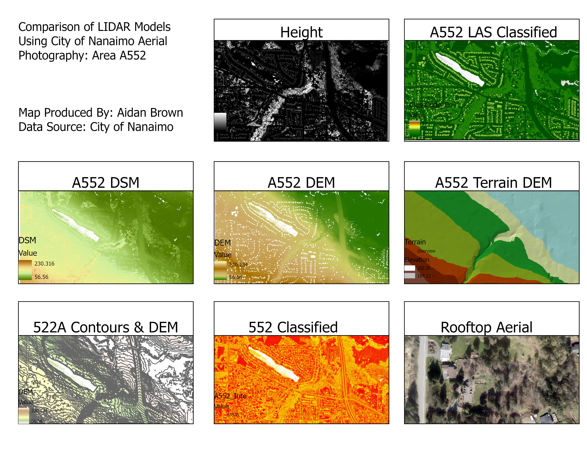

## Aidan Brown
## GEOG 523 Fall 2023

## Question 1

- **Datum** - D North American 1983
- **Projection** - Transverse Mercator 
- **Units** - Meters

## Question 2

- **57,309,186** LAS points in this LIDAR dataset.

##  Question 3

- 0.234 meters is the average point spacing, **meters** are the units of measurement.

## Question 4

- 0.907 as the complete average sampling value for all the LAS points.

## Question 5

- Water in the study area contains NODATA values. This is because water is not a reflective surface and LIDAR imagery won't be able to be gathered.

## Question 6

- Classification values that are missing:

8, 10, 11, 12, 13, 14, 15, 16, 18, 19-63, 63-225.

## Question 7

- Buildings and high vegetation are displayed with multiple returns, and water objects are displayed with no returns within the objects.

## Question 8

- Class codes used to create DSM:

2, 3, 4, 5, 6, 9, 17.

## Question 9

- **Min value** - 56.56
- **Max Value** - 230.316

## Question 10

- **Class Codes:** 2, 9

## Question 11

- **Min Value:** 56.56
- **Max Value:** 220.134

## Question 12

- Used interval of the average (0.907).
- Contours don't match as well as they could because of user input errors, or different scales or resolutions that have conflictions with the base shapefile.

## Question 13

- **Raster Calculator** can perform a differential between raster features.
- **Surface Difference** calculates the difference between two surfaces ie DSM/DTM

## Question 14

Approximate height of the tree is 169 meters, with a class code of 5, meaning it's high vegetation.

## Question 17

